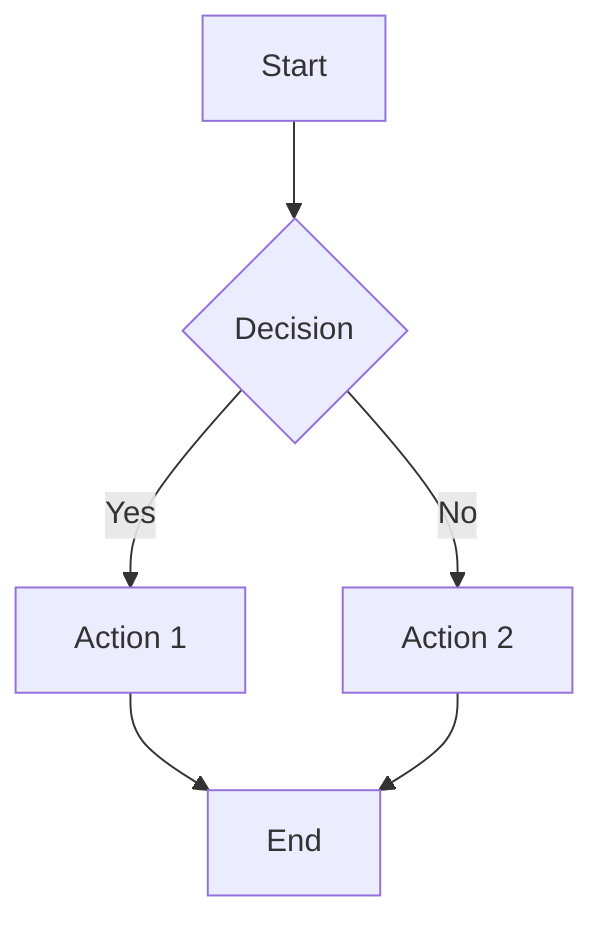

# 📚 Findoora Docs


> A modern, highly extensible documentation platform built with Next.js 15, designed for developers who want powerful content management with exceptional user experience.

<div align="center">

[](https://nextjs.org/)
[](https://www.typescriptlang.org/)
[](https://mdxjs.com/)
[](https://www.docker.com/)
[](https://opensource.org/licenses/MIT)

</div>

**Findoora Docs** is a cutting-edge documentation platform that combines the simplicity of Markdown with the power of React components. Built for teams and individuals who need a fast, scalable, and beautiful way to create and share knowledge.

## ✨ Key Features

### 🎯 **Content-First Architecture**

- **Flexible Content System**: Support for blogs, documentation, tutorials, guides, and custom content types
- **MDX Integration**: Write in Markdown, enhance with React components
- **Category-Based Organization**: Automatic navigation and filtering by content categories
- **Frontmatter Support**: Rich metadata with custom fields

### 🚀 **Performance & Developer Experience**

- **Next.js 15 App Router**: Latest Next.js features with optimal performance
- **TypeScript Throughout**: Full type safety from content to components
- **Bundle Analysis**: Built-in tools to monitor and optimize bundle size
- **Hot Reload**: Instant feedback during development
- **Docker Ready**: Production-ready containerization

### 🎨 **Beautiful User Interface**

- **shadcn/ui Components**: Modern, accessible UI components
- **Responsive Design**: Mobile-first approach with seamless desktop experience
- **Dark/Light Mode**: System-aware theme switching
- **Interactive Navigation**: Smart sidebar with breadcrumbs and table of contents
- **Search Functionality**: Powerful full-text search with live suggestions

### 🔧 **Advanced Features**

- **Mermaid Diagrams**: Render complex diagrams and flowcharts
- **Syntax Highlighting**: Beautiful code blocks with GitHub-style themes
- **Social Sharing**: Built-in sharing for all major platforms
- **SEO Optimized**: Structured data, Open Graph, and sitemap generation
- **Accessibility**: WCAG 2.1 AA compliant with screen reader support

## 🚀 Quick Start

### Option 1: Docker (Recommended)

```bash
# Clone and start
git clone https://github.com/muralitmuthuhotmail/findoora-docs.git
cd findoora-docs
docker-compose up -d

# Visit http://localhost:3000
```

### Option 2: Local Development

```bash
# Prerequisites: Node.js 18+ and pnpm
git clone https://github.com/muralitmuthuhotmail/findoora-docs.git
cd findoora-docs

# Install dependencies
pnpm install

# Start development server
pnpm dev

# Visit http://localhost:3000
```

### Option 3: Deploy to Vercel

[](https://vercel.com/new/clone?repository-url=https://github.com/muralitmuthuhotmail/findoora-docs)

## � Use Cases

### 🏢 **For Teams & Organizations**

- **Technical Documentation**: API docs, implementation guides, troubleshooting
- **Knowledge Base**: Internal wikis, onboarding materials, best practices
- **Product Documentation**: User guides, feature announcements, changelog
- **Engineering Blogs**: Technical insights, architecture decisions, tutorials

### 👤 **For Individual Developers**

- **Personal Blog**: Share knowledge, document learning journey
- **Portfolio Website**: Showcase projects with detailed case studies
- **Tutorial Platform**: Create step-by-step learning materials
- **Note-Taking System**: Organize research, code snippets, and ideas

### 🎓 **For Education**

- **Course Materials**: Lessons, assignments, resources
- **Research Documentation**: Papers, methodology, findings
- **Student Portfolios**: Academic work, projects, achievements
- **Learning Paths**: Structured curriculum with progress tracking

### 🚀 **For Open Source Projects**

- **Project Documentation**: Setup guides, contribution guidelines
- **API Reference**: Comprehensive endpoint documentation
- **Community Hub**: Announcements, FAQ, community guidelines
- **Change Documentation**: Release notes, migration guides

## 🛠 Technology Stack

### **Core Framework**

- **[Next.js 15](https://nextjs.org/)** - React framework with App Router
- **[TypeScript](https://www.typescriptlang.org/)** - Type-safe JavaScript
- **[Tailwind CSS](https://tailwindcss.com/)** - Utility-first CSS framework
- **[shadcn/ui](https://ui.shadcn.com/)** - High-quality React components

### **Content Management**

- **[MDX](https://mdxjs.com/)** - Markdown with React components
- **[next-mdx-remote](https://github.com/hashicorp/next-mdx-remote)** - Remote MDX compilation
- **[remark](https://remark.js.org/)** & **[rehype](https://github.com/rehypejs/rehype)** - Markdown processing
- **[Mermaid](https://mermaid.js.org/)** - Diagram and flowchart generation

### **Performance & SEO**

- **[Bundle Analyzer](https://www.npmjs.com/package/@next/bundle-analyzer)** - Bundle size optimization
- **Structured Data** - Schema.org integration
- **Open Graph** - Social media optimization
- **Sitemap Generation** - Automatic SEO indexing

### **Development Tools**

- **[pnpm](https://pnpm.io/)** - Fast, efficient package manager
- **[Docker](https://www.docker.com/)** - Containerization for deployment
- **ESLint & Prettier** - Code quality and formatting
- **Turbopack** - Fast bundler for development

## 📁 Project Architecture

```
findoora-docs/
├── app/                          # Next.js App Router
│   ├── [category]/              # Dynamic category routes
│   │   ├── page.tsx            # Category listing page
│   │   └── [slug]/             # Individual content pages
│   ├── api/                    # API routes
│   │   ├── search/             # Search functionality
│   │   ├── navigation/         # Navigation data
│   │   └── health/             # Health check
│   ├── layout.tsx              # Root layout with navigation
│   └── page.tsx                # Homepage
├── components/                  # React components
│   ├── blocks/                 # Content blocks
│   │   ├── mdx/               # MDX components
│   │   ├── content-list.tsx   # Content listing
│   │   └── table-of-contents.tsx
│   ├── features/              # Feature components
│   │   ├── search-dialog.tsx  # Search interface
│   │   ├── back-to-top.tsx    # Navigation helper
│   │   └── social-share.tsx   # Social sharing
│   ├── layout/                # Layout components
│   │   ├── app-bar.tsx        # Top navigation
│   │   ├── navigation-sidebar.tsx
│   │   └── mobile-navigation.tsx
│   ├── pages/                 # Page-specific components
│   ├── providers/             # Context providers
│   ├── seo/                   # SEO components
│   └── ui/                    # Reusable UI components
├── lib/                        # Utility functions
│   ├── content.ts             # Content management
│   ├── config.ts              # App configuration
│   └── utils/                 # Helper utilities
├── posts/                      # MDX content files
├── public/                     # Static assets
├── styles/                     # CSS and styling
├── types/                      # TypeScript definitions
├── docker-compose.yml          # Docker configuration
├── dockerfile                  # Docker build instructions
└── next.config.ts             # Next.js configuration
```

## 🛠️ Development

### Prerequisites

- Node.js >= 18 (for local development)
- pnpm >= 10.7.0 (for local development)
- Docker & Docker Compose (for containerized deployment)

### Getting Started

```bash
# Install dependencies
pnpm install

# Start development server
pnpm dev

# Open the site in your browser using the BASE_URL from lib/urls.ts
```

## 🐳 Docker Deployment

### Quick Start with Docker Compose

```bash
# Build and start the application
docker-compose up -d

# View logs
docker-compose logs -f

# Stop the application
docker-compose down
```

### Manual Docker Build

```bash
# Build the Docker image
docker build -t findoora-docs .

# Run the container
docker run -d \
  --name findoora-docs \
  -p 3000:3000 \
  -e NODE_ENV=production \
  findoora-docs

# View logs
docker logs -f findoora-docs

# Stop and remove container
docker stop findoora-docs
docker rm findoora-docs
```

### Production Deployment

For production environments, consider:

1. **Environment Variables**: Set appropriate environment variables
2. **Reverse Proxy**: Use nginx or similar for SSL termination
3. **Health Checks**: Monitor `/api/health` endpoint
4. **Resource Limits**: Set memory and CPU limits
5. **Logging**: Configure proper log aggregation

```bash
# Production deployment with resource limits
docker run -d \
  --name findoora-docs-prod \
  -p 3000:3000 \
  -e NODE_ENV=production \
  -e NEXT_TELEMETRY_DISABLED=1 \
  --memory=512m \
  --cpus=1 \
  --restart=unless-stopped \
  findoora-docs
```

### Docker Compose with Nginx (Production)

```yaml
# docker-compose.prod.yml
version: "3.8"
services:
  docs:
    build: .
    environment:
      - NODE_ENV=production
    restart: unless-stopped

  nginx:
    image: nginx:alpine
    ports:
      - "80:80"
      - "443:443"
    volumes:
      - ./nginx.conf:/etc/nginx/nginx.conf:ro
      - ./ssl:/etc/nginx/ssl:ro
    depends_on:
      - docs
    restart: unless-stopped
```

### Available Scripts

```bash
# Development
pnpm dev              # Start development server with Turbopack
pnpm build            # Build for production
pnpm start            # Start production server
pnpm preview          # Preview production build locally

# Code Quality
pnpm lint             # Run ESLint
pnpm lint:fix         # Fix ESLint issues
pnpm typecheck        # Run TypeScript type checking
pnpm format           # Format code with Prettier

# Testing
pnpm test             # Run tests
pnpm test:watch       # Run tests in watch mode
pnpm test:coverage    # Run tests with coverage
pnpm test:ui          # Run tests with UI

# Analysis
pnpm analyze          # Analyze bundle size
pnpm build:analyze    # Build and analyze bundle
```

### Environment Variables

Create a `.env.local` file in the root directory:

```env
# Base URL for the application
NEXT_PUBLIC_BASE_URL=http://localhost:3000

# Google Analytics (optional)
NEXT_PUBLIC_GA_ID=your-ga-id
```
## 📝 Content Management

### **Creating Content**

1. **Add a new MDX file** in the `posts/` directory:

```mdx
---
menuTitle: "Getting Started"
title: "Getting Started with Findoora Docs"
publishedAt: "2024-07-26"
summary: "Learn how to set up and customize your documentation site"
category: "documents"
author: "Your Name"
tags: ["setup", "configuration", "getting-started"]
thumbnail: "/images/getting-started.jpg"
---
```

# Getting Started

Welcome to your new documentation site! This guide will help you...

## Installation

Follow these steps to get started:

1. Clone the repository
2. Install dependencies
3. Start developing

```typescript
// Your code examples with syntax highlighting
const config = {
  title: "My Documentation",
  description: "A comprehensive guide"
};
```

## Next Steps

- [ ] Customize your site configuration
- [ ] Add your first content
- [ ] Deploy to production

### **Supported Content Types**

| Type             | Category     | Use Case                        | Example                                   |
|------------------|-------------|----------------------------------|-------------------------------------------|
| **Blog Posts**   | `blog`      | Articles, thoughts, announcements| Company updates, technical insights       |
| **Documentation**| `docs`      | Technical guides, API references | Installation guides, API documentation    |
| **Tutorials**    | `tutorial`  | Step-by-step learning            | How-to guides, code walkthroughs          |
| **Guides**       | `guide`     | Best practices, methodologies    | Style guides, workflow documentation      |
| **Reference**    | `reference` | Quick lookups, specifications    | Command references, configuration options |
| **Custom**       | `any-name`  | Your unique content types        | Press releases, case studies, etc.        |

### **Rich Content Features**

#### **Code Blocks with Syntax Highlighting**
````mdx
```typescript
interface User {
  id: string;
  name: string;
  email: string;
}

const users: User[] = await fetchUsers();
`````

`````

#### **Mermaid Diagrams**
````mdx

`````

#### **Task Lists**

```mdx
- [x] Completed task
- [ ] Pending task
- [ ] Future enhancement
```

#### **Tables with Alignment**

```mdx
| Left | Center | Right |
| :--- | :----: | ----: |
| Data |  Data  |  Data |
```

#### **Callouts and Quotes**

```mdx
> 💡 **Pro Tip**: Use frontmatter to add rich metadata to your content.

> ⚠️ **Warning**: Always backup your content before major changes.
```

### **Content Organization**

#### **Automatic Navigation**

The platform automatically generates navigation based on your content structure:

- Categories become top-level navigation items
- Individual posts become sub-navigation items
- Menu titles are used for clean navigation labels

#### **Search Integration**

All content is automatically indexed for search:

- Full-text search across titles, summaries, and content
- Category-based filtering
- Relevance scoring with highlighted matches
- Search suggestions and popular terms

#### **SEO & Social Sharing**

Every piece of content gets:

- Structured data for search engines
- Open Graph meta tags for social sharing
- Twitter Card support
- Automatic sitemap generation
- Optimized URLs based on categories and slugs

## ⚙️ Configuration

### **Environment Variables**

Create a `.env.local` file for local development:

```bash
# Base URL for your site
NEXT_PUBLIC_BASE_URL=http://localhost:3000

# API Base URL (usually same as base URL)
NEXT_PUBLIC_BASE_API_URL=http://localhost:3000

# Optional: Google Analytics
NEXT_PUBLIC_GA_ID=G-XXXXXXXXXX

# Optional: Google Site Verification
GOOGLE_SITE_VERIFICATION=your-verification-code

# Optional: Disable telemetry
NEXT_TELEMETRY_DISABLED=1
```

### **Site Configuration**

Update `lib/config.ts` to customize your site:

```typescript
export const SITE_NAME = "Your Docs Site";
export const SITE_SUB_TITLE = "Documentation";
export const SITE_DESCRIPTION = "Your site description";
export const GITHUB_URL = "https://github.com/your-username/your-repo";
export const SITE_AUTHOR = "@your-handle";
// ... more configuration options
```

### **Styling & Theming**

The platform uses Tailwind CSS with CSS custom properties for theming:

```css
/* styles/theme.css */
:root {
  --background: 0 0% 100%;
  --foreground: 222.2 84% 4.9%;
  --primary: 222.2 47.4% 11.2%;
  /* ... more theme variables */
}

[data-theme="dark"] {
  --background: 222.2 84% 4.9%;
  --foreground: 210 40% 98%;
  /* ... dark theme overrides */
}
```

## 📦 Deployment

### **Docker Deployment**

1. **Using Docker Compose** (Recommended):

```bash
# Production deployment
docker-compose up -d

# View logs
docker-compose logs -f

# Stop services
docker-compose down
```

2. **Using Docker directly**:

```bash
# Build image
docker build -t findoora-docs .

# Run container
docker run -p 3000:3000 findoora-docs
```

### **Vercel Deployment**

1. **One-click deploy**

   [](https://vercel.com/new/clone?repository-url=https://github.com/muralitmuthuhotmail/findoora-docs)

2. **Manual deployment**:

```bash
# Install Vercel CLI
npm i -g vercel

# Deploy
vercel --prod
```

### **Other Platforms**

**Netlify**:

```bash
# Build command
pnpm build

# Publish directory
.next
```

**AWS/DigitalOcean/Railway**:

- Use the provided `dockerfile` for container-based deployment
- Set environment variables in your platform's dashboard
- Ensure Node.js 18+ is available

## 🧪 Development

### **Available Scripts**

```bash
# Development
pnpm dev                 # Start development server with Turbopack
pnpm dev:debug          # Start with debugging enabled

# Building
pnpm build              # Production build
pnpm start              # Start production server
pnpm build:analyze      # Build with bundle analysis

# Code Quality
pnpm lint               # Run ESLint
pnpm lint:fix           # Fix linting issues
pnpm format             # Format code with Prettier
pnpm typecheck          # TypeScript type checking

# Testing
pnpm test               # Run tests
pnpm test:watch         # Run tests in watch mode
pnpm test:coverage      # Generate coverage report
```

### **Development Workflow**

1. **Start the development server**:

```bash
pnpm dev
```

2. **Add content** to `posts/` directory with `.mdx` extension

3. **Customize components** in the `components/` directory

4. **Update configuration** in `lib/config.ts`

5. **Test your changes** and ensure type safety:

```bash
pnpm typecheck && pnpm lint
```

### **Adding Custom Components**

Create reusable MDX components:

```typescript
// components/blocks/mdx/custom-component.tsx
interface CustomComponentProps {
  title: string;
  children: React.ReactNode;
}

export function CustomComponent({ title, children }: CustomComponentProps) {
  return (
    <div className="my-6 p-4 border rounded-lg">
      <h3 className="text-lg font-semibold mb-2">{title}</h3>
      <div className="prose">{children}</div>
    </div>
  );
}
```

Register it in `custom-mdx.tsx`:

```typescript
import { CustomComponent } from "./custom-component";

const components = {
  // ... existing components
  CustomComponent,
};
```

Use in MDX content:

```mdx
<CustomComponent title="Important Note">
  This is a custom component with **markdown** support!
</CustomComponent>
```

## 🤝 Contributing

We welcome contributions from the community! Here's how you can help:

### **Ways to Contribute**

- 🐛 **Bug Reports**: Found an issue? Let us know!
- 💡 **Feature Requests**: Have an idea? We'd love to hear it!
- 📖 **Documentation**: Help improve our docs
- 🎨 **Design**: UI/UX improvements and accessibility enhancements
- 🔧 **Code**: Bug fixes, new features, and optimizations

### **Development Setup**

1. **Fork the repository** on GitHub
2. **Clone your fork**:

```bash
git clone https://github.com/your-username/findoora-docs.git
cd findoora-docs
```

3. **Install dependencies**:

```bash
pnpm install
```

4. **Create a feature branch**:

```bash
git checkout -b feature/your-feature-name
```

5. **Make your changes** and test thoroughly
6. **Submit a pull request** with a clear description

### **Contribution Guidelines**

- ✅ Follow the existing code style and conventions
- ✅ Write tests for new features and bug fixes
- ✅ Update documentation for any API changes
- ✅ Ensure all tests pass and there are no linting errors
- ✅ Keep commits focused and write clear commit messages

### **Open Source Standards: Git Hooks**

To maintain high code quality and consistency, Findoora Docs uses [Husky](https://typicode.github.io/husky/) and [lint-staged](https://github.com/okonet/lint-staged) for Git hooks:

- **Pre-commit**: Runs ESLint and Prettier on staged files to catch lint and formatting issues before committing.
- **Pre-push**: Runs type checking and tests to ensure code correctness before pushing to the repository.

**Configuration Example:**

```json
// package.json
{
  "lint-staged": {
    "*.{js,jsx,ts,tsx}": ["eslint --fix", "prettier --write"],
    "*.{md,mdx}": ["prettier --write"]
  },
  "husky": {
    "hooks": {
      "pre-commit": "lint-staged",
      "pre-push": "pnpm typecheck && pnpm test"
    }
  }
}
```

**How it works:**

- On `git commit`, only properly formatted and linted code is committed.
- On `git push`, code must pass type checks and tests, preventing broken code from entering the repository.

> 💡 **Tip:** Install Husky after cloning with `pnpm dlx husky install` if not already set up.

For more details, see the [Contributing Guide](./md-content/contributing.mdx).

### **Code of Conduct**

We are committed to providing a welcoming and inclusive environment for all contributors. Please read our [Code of Conduct](CODE_OF_CONDUCT.md) before contributing.

## 📄 License

This project is licensed under the [MIT License](LICENSE) - see the LICENSE file for details.

### **What this means:**

- ✅ **Commercial Use**: Use this project in commercial applications
- ✅ **Modification**: Modify the source code to fit your needs
- ✅ **Distribution**: Distribute the original or modified versions
- ✅ **Private Use**: Use the project for personal or internal purposes
- ❗ **No Warranty**: The software is provided "as is" without warranty
- ❗ **Attribution Required**: Include the original license in any distribution

## 🙏 Acknowledgments

### **Built With Love Using**

- [Next.js](https://nextjs.org/) - The React framework for production
- [shadcn/ui](https://ui.shadcn.com/) - Beautiful and accessible React components
- [Tailwind CSS](https://tailwindcss.com/) - A utility-first CSS framework
- [MDX](https://mdxjs.com/) - Markdown for the component era
- [TypeScript](https://www.typescriptlang.org/) - JavaScript with syntax for types

### **Inspired By**

- [Docusaurus](https://docusaurus.io/) - Documentation platform excellence
- [GitBook](https://www.gitbook.com/) - Beautiful documentation experiences
- [Notion](https://www.notion.so/) - Modern content management
- [Linear](https://linear.app/) - Clean and performant web applications

---

<div align="center">

**[⭐ Star this project](https://github.com/muralitmuthuhotmail/findoora-docs)** • **[🐛 Report Bug](https://github.com/muralitmuthuhotmail/findoora-docs/issues)** • **[💡 Request Feature](https://github.com/muralitmuthuhotmail/findoora-docs/issues)**

Made with ❤️ by [Murali Thangamuthu](https://github.com/muralitmuthuhotmail)

</div>
